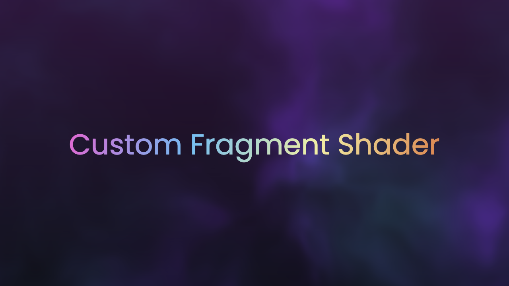

# Custom Fragment Shader

## 概要

Flutter で高度なグラフィックスを実現するために、これまでは RenderObject や CustomPainter を利用していました。
しかし、これらは CPU 上で多くの処理を実行することになってしまうため、柔軟性や表現力にどうしても限界がありました。

Flutter 2.8 で Fragment Shader を利用可能になり、GPU 上で処理を実行できるようになったため、より柔軟で高度なグラフィックスを実現できるようになりました。

このプロジェクトでは、Fragment Shader の基礎から Flutter での具体的な実装例についてご紹介します。

## トピック

- Fragment Shader とは
- Flutter で Fragment Shader が実行されるまでの仕組み
- Flutter における Fragment Shader の実装方法
- Fragment Shader の実装例と解説
    - Pixelate
    - Ink Sparkle
    - Hologram Effect
    - Transition Animation

